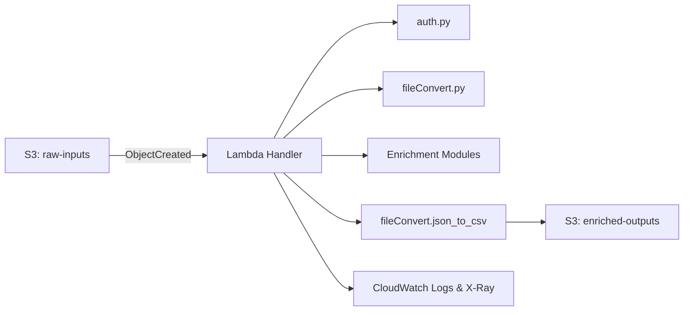

# Technical Requirements Document

**Project:** Data Enrichment Tool Migration to AWS Lambda & S3\
**Revision Date:** April 17, 2025\
**Prepared for:** Cursor AI Agent Development Team

---

## 1. Purpose

Define requirements to migrate the existing Data Enrichment Tool to a serverless AWS architecture using Lambda and S3, enabling automated ingestion, enrichment, and storage of CSV data via the ZoomInfo API.

## 2. Scope

- Replace desktop UI with event-driven Lambda functions
- Store raw and enriched files in S3 buckets
- Securely manage API credentials
- Provide observability, monitoring, and error handling

## 3. Audience

This document is addressed to the Cursor AI Agent Development Team responsible for implementing and deploying the serverless solution.

## 4. High-Level Architecture

## 5. AWS Resources

- **Amazon S3**: Two buckets—`raw-inputs` (prefix `raw/`) for uploads and `enriched-outputs` (prefix `enhanced/`) for results.
- **AWS Lambda**: Single function (`lambda_function.py`) triggered by S3 events.
- **AWS Secrets Manager**: Store ZoomInfo credentials under the secret name defined by `ZOOMINFO_SECRET_NAME`.
- **AWS IAM**: Least-privilege role for Lambda with permissions for S3 and Secrets Manager.
- **Amazon CloudWatch**: Logs, alarms, and optional X-Ray tracing.
- **Amazon EventBridge** (optional): Scheduled or conditional triggers.

## 6. Functional Requirements

1. **Event Trigger**
   - S3 `ObjectCreated:Put` on `raw-inputs/*.csv` invokes the Lambda function.
2. **Lambda Handler**
   - Function signature: `def handler(event, context):`
   - Parse `bucket` and `key` from the event payload.
   - Download the CSV to `/tmp/` within Lambda.
3. **Data Conversion & Enrichment**
   - Refactor `fileConvert.csv_to_json` for CSV→JSON conversion.
   - Process JSON through enrichment modules:
     - `contactEnrich.contact_enrich`
     - `companyEnrich.company_enrich`
     - `contactSearch.contact_search`
     - `addNewContact.add_new_contact`
     - `naicsMatch.get_sector_and_industry`
   - Convert enriched JSON back to CSV via `fileConvert.json_to_csv`.
4. **File Upload**
   - Upload the enriched CSV to the `enriched-outputs` bucket, preserving the original filename.
5. **ZoomInfo API Integration**
   - Retrieve API credentials from Secrets Manager.
   - Refactor `auth.authenticate` for non-interactive token acquisition.
   - Implement in-memory token caching until expiration.

## 7. Non-Functional Requirements

- **Performance**: Aim for average execution time < 60 seconds.
- **Scalability**: Support concurrent Lambda invocations up to expected event rates.
- **Security**: Enable SSE on S3 buckets; enforce least-privilege IAM policies; no hard-coded credentials.
- **Cost Efficiency**: Optimize memory (start at 512 MB) and timeout (max 5 minutes).
- **Maintainability**: Modular code structure; clear separation of concerns; structured logging.

## 8. Security & Compliance

- **Secrets Management**: Use AWS Secrets Manager for storing and rotating credentials.
- **Encryption**: Enable server-side encryption (SSE-S3 or SSE-KMS) on S3 buckets.
- **Access Control**: Restrict S3 and Secrets Manager access via IAM policies.
- **Audit Logging**: Enable CloudTrail for Lambda and Secrets Manager activities.

## 9. Error Handling & Retries

- Wrap external API calls with retry logic and exponential backoff.
- On unhandled exceptions, allow Lambda to retry based on its configuration.
- Configure a Dead-Letter Queue (DLQ) for failed events.

## 10. Deployment & CI/CD

- **Infrastructure as Code**: Use AWS SAM or Terraform to define resources.
- **Build & Deploy**: Implement CI/CD pipeline (GitHub Actions or AWS CodePipeline).
- **Packaging Options**:
  - **ZIP**: Package dependencies and code into a Lambda ZIP.
  - **Container**: Build a container image if dependencies exceed ZIP limits.

## 11. Testing & Validation

- **Unit Tests**: Mock ZoomInfo API and S3 interactions.
- **Integration Tests**: Upload test CSVs; verify enriched outputs in S3.
- **Performance Tests**: Use large datasets to benchmark execution time and memory.
- **Security Tests**: Validate IAM permissions and S3 bucket policies.

## 12. Monitoring & Alerting

- **CloudWatch Alarms**:
  - Errors > 1/minute triggers SNS notifications.
  - Duration > 80% of Lambda timeout.
- **Custom Metrics**: Track number of records processed, success/failure counts.
- **Dashboards**: Visualize invocation count, duration, error rates.

## 13. Timeline & Milestones

| Milestone                       | Target Date  |
| ------------------------------- | ------------ |
| **Design Review & Sign‑off**    | Apr 24, 2025 |
| **Infrastructure Provisioning** | May 1, 2025  |
| **Code Refactoring Complete**   | May 8, 2025  |
| **Testing & QA**                | May 15, 2025 |
| **Production Deployment**       | May 22, 2025 |

---

*End of TRD.*

